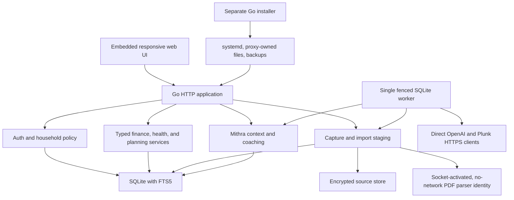
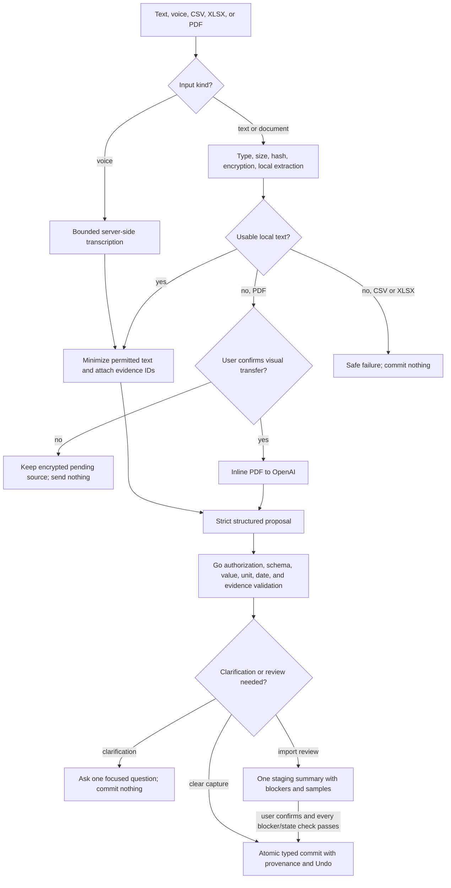
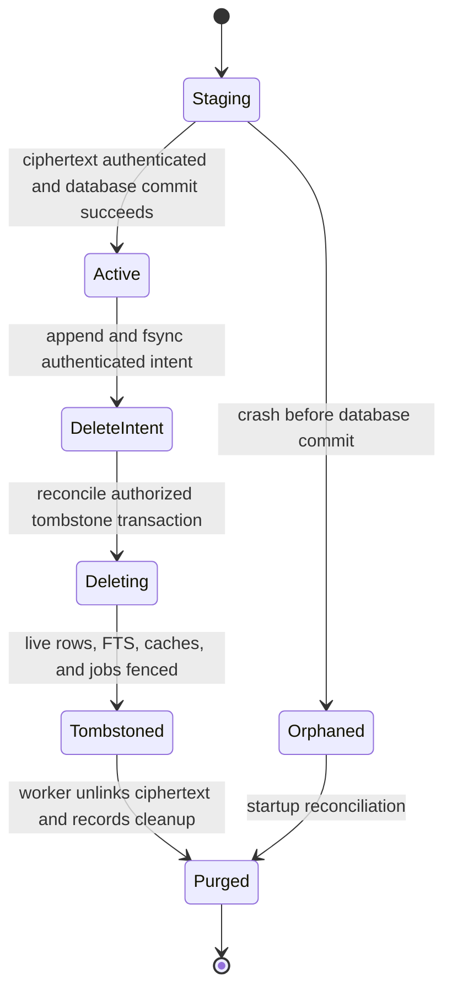
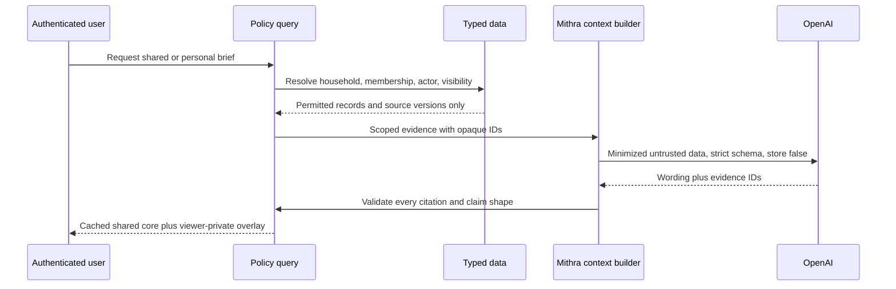
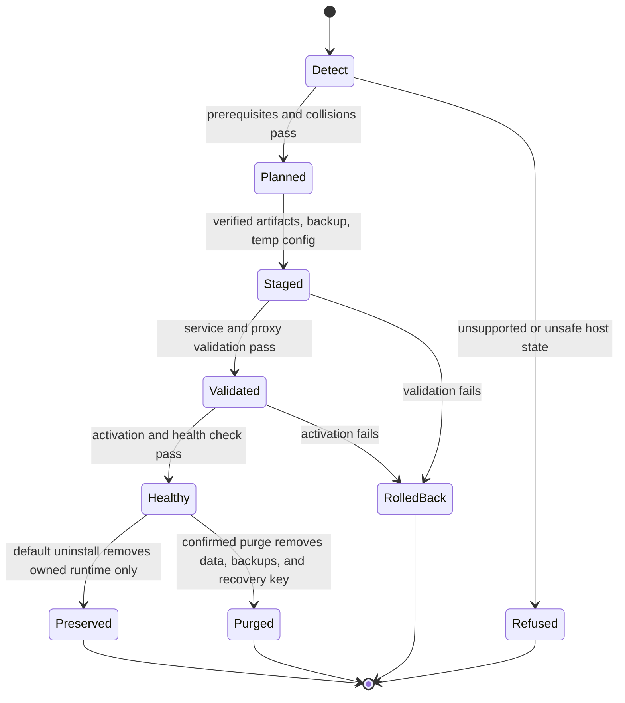

# Mithra V1 Family Superapp - Plan

## Goal Capsule

- **Objective:** Ship a hosted, production-shaped Mithra V1 for couples that unifies finance, health trends, planning, and factual AI coaching without autonomous external actions.
- **Authority:** Confirmed product decisions in this plan outrank implementation convenience. Current Arivu patterns guide the Go runtime and installer, while Mithra-specific privacy and encrypted-data requirements take precedence where Arivu differs.
- **Execution profile:** Build one low-dependency Go application and one Go installer, both from this repository, with SQLite persistence and an embedded responsive web interface.
- **Launch boundary:** The Build Week submission deadline is July 21, 2026 at 5:00 PM PDT, which is July 22, 2026 at 5:30 AM IST.
- **Stop conditions:** Stop and escalate if implementation would expose one partner's private data, require weakening authentication or encryption, mutate Arivu or global shared-VPS state, make a destructive migration non-recoverable, or require a product-scope decision that contradicts this contract.
- **Tail ownership:** The implementation executor owns unit sequencing, atomic commits, verification, deployment, and documentation. The operator owns credentials, DNS, VPS approval, judge access, and final Devpost submission.

---

## Product Contract

### Summary

Mithra V1 is a private, hosted couples superapp that turns scattered conversations and existing files into shared or personal finance, health, and planning records.
Its calm AI coach produces evidence-linked Family Briefs and Week in Review summaries while deterministic application logic owns calculations, permissions, dates, and state.

### Problem Frame

Busy couples manage important household information across spreadsheets, reports, calendars, chat messages, and purpose-built apps.
The fragmentation hides relationships between money, health, and plans, while maintaining a separate system creates more work.

Mithra reduces that cognitive load by accepting the formats couples already use, extracting structured records with minimal correction, and presenting one factual household view.
It remains useful to one partner before the second joins and never turns private information, human disagreements, or sensitive decisions into material for judgment.

### Actors

- A1. **Household owner:** The first allowlisted adult to activate an account; manages the partner invitation, OpenAI key, and household-level settings.
- A2. **Partner:** The second allowlisted adult; has equal edit access to shared records and sole access to their personal records.
- A3. **Operator:** Installs, upgrades, backs up, restores, reconfigures, resets the seed fixture, and manages the server allowlist without reading household content through an admin UI.
- A4. **Mithra:** A bounded AI coach that proposes structured records and factual insights from already-authorized context but cannot change privacy, execute external actions, or invent missing facts.

### Requirements

**Home and coaching**

- R1. The authenticated home is a calm Family Brief led by the most relevant current change or conflict, followed by upcoming dates and no more than three suggested priorities; dedicated lenses emphasize finance changes and obligations, a health timeline, and the planning calendar rather than equal generic cards.
- R2. The app provides dedicated Finance, Health, and Planning lenses over one shared household model, with global text and voice capture available from every lens.
- R3. Week in Review presents material changes, upcoming dates, stale or inconsistent records, and a visibly separate, screen-reader-labelled `Only you` section without scores, streaks, blame, mediation, or a reset metaphor.
- R4. Mithra stays factual, source-linked, and non-judgmental; cross-domain statements describe evidence-linked temporal co-occurrence without causal language, and it gives no medical, investment, tax, relationship, booking, spending, or transaction advice.
- R5. AI failure never hides deterministic records, trends, calendars, or the most recent still-authorized labelled brief; wording invalidated by a privacy change is removed even during provider failure.

**Identity, households, and privacy**

- R6. V1 supports invitation-only households with at most two adults, separate accounts, one initial owner, and no automatic household merging.
- R7. Public signup does not exist; only emails in the operator-managed allowlist may request or consume a password-reset token, while every request receives a generic non-enumerating response.
- R8. Browser authentication uses cookie-only server sessions, Argon2id passwords, one-time hashed reset and invitation tokens, CSRF protection, canonical-origin links, trusted-proxy enforcement, request limits, and immediate account/session disablement and invitation revocation when an email is removed from the allowlist.
- R9. Every source and derived record is either Personal or Shared; Personal is the safe default, the user controls visibility, and AI never changes it.
- R10. Shared AI context contains shared records only; personal coaching contains the requesting user's personal records plus shared records, with filtering completed before any provider request.
- R11. Both partners may edit shared records with provenance and optimistic conflict detection; only the owner of a personal record may read or mutate it.

**Capture, imports, and source lifecycle**

- R12. Text capture saves a visible extracted summary with Undo when clear, asks one clarification when material data is ambiguous, and never invents an owner, date, amount, unit, or status.
- R13. Voice capture uses the browser microphone with bounded bytes and duration, stores retryable audio only as short-lived encrypted source ciphertext, transcribes server-side, and retains that ciphertext only until the user confirms the transcript and proposed records or a bounded retry/abandonment window expires.
- R14. Imports accept one CSV, XLSX, or PDF file up to 10 MB; corrupt, encrypted, password-protected, extra-part, and unsupported inputs fail safely.
- R15. CSV, XLSX, and text-bearing PDF content is parsed locally, and only the necessary extracted text is sent to OpenAI with storage disabled.
- R16. A scanned or structurally unreadable PDF is sent inline to OpenAI only after a per-file explanation and explicit confirmation; cancellation sends no file.
- R17. Import mapping is AI-led and user-corrected through one blocker-first summary with separate warnings, new/changed samples, direct inline correction, duplicate detection, missing dates, unit mismatches, inconsistent totals, and outliers; final import preserves edits, focuses the first unresolved blocker, and commits atomically only when every blocker clears.
- R18. Exact duplicate files are skipped, changed files create linked source versions, and the review identifies new and changed records without silent overwrite.
- R19. Original imports are encrypted and retained for provenance, export, and reprocessing; deletion first shows source visibility and dependent record/reminder/insight counts, then a confirmed request durably records an authenticated deletion intent before it immediately tombstones the source, removes dependent live state, and fences jobs so crashes or older local backups cannot resurrect it.

**Typed domain behavior**

- R20. Finance imports and captures create typed income, spending, asset, liability, budget, and obligation records with exact decimal arithmetic, deterministic trends, and plain numbers without currency fields, symbols, selection, or conversion; a source containing multiple explicit currency contexts is unsupported and blocked rather than aggregated.
- R21. Health imports and captures preserve observed values, units, dates, specimen, available method/reference context, and reference ranges; a trend includes only observations with the same analyte and compatible comparability context, while unmatched observations remain separate. Only an explicit registry of compatible conversions may normalize units; other mismatches require the user to supply the correct value and unit.
- R22. Planning represents goals, plans, milestones, events, owners, dates, dependencies, and constraints without becoming a general-purpose task list.
- R23. Planning provides accessible month, week, and agenda calendar views, one-event ICS download, and a prefilled Google Calendar draft; exports are user-reviewed snapshots with no OAuth, background sync, or direct calendar write.
- R24. AI-derived records and insights retain actor, model, prompt/schema version, source versions, evidence references, visibility scope, data revision, and generation time; user corrections create superseding revisions, survive reprocessing, and are the only active values used by calculations.

**Cost, notifications, and operations**

- R25. AI work runs only on meaningful source changes, explicit user requests, capture/import processing, or scheduled Week in Review generation; page loads use versioned cached results.
- R26. A dated, owned item may produce one timely in-app and generic email nudge with an update action; a visibly off-by-default follow-up may be enabled explicitly, after which acknowledgement or transition to stale/awaiting-update ends the nudge sequence without further nagging.
- R27. The hosted app uses arbitrary valid user imports and the same code paths as the seeded household; synthetic data may not trigger hardcoded insights or special product behavior.
- R28. The operator can plan, install, reconfigure, upgrade, inspect status, back up, restore, uninstall, and explicitly purge Mithra on the shared VPS without preparing a fresh server or changing Arivu, unrelated services, global firewall policy, or unowned proxy configuration.
- R29. Uploaded sources, stored OpenAI credentials, and local backup archives are encrypted with keys derived from a master key available only to root, the dedicated service identity, and recovery operations; restore verifies key, archive, database, files, and deletion journal before replacing live state, discards restored sessions, tokens, leases, pending mail, and caches, invalidates restored password hashes, and requires the owner to enter the OpenAI key again.
- R30. The project submission includes a working hosted app, repository, setup and sample-data documentation, a public narrated video under three minutes, the primary Codex feedback session ID, and evidence mapping meaningful GPT-5.6 Sol and Luna work to architecture decisions, implemented code/tests, review findings, and browser/operations verification; runtime AI remains GPT-5.4-mini plus the dedicated transcription model.

### Key Flows

- F1. **First use and partner join**
  - **Trigger:** An allowlisted adult opens the hosted app.
  - **Actors:** A1, A2.
  - **Steps:** The user requests a reset link, sets a password, and becomes the owner of a one-person household if no invitation applies. Settings then explains that deterministic lenses work immediately while AI capture, imports, and coaching remain unavailable until the owner validates an OpenAI key. The owner may later invite a second allowlisted adult, who joins only through that invitation.
  - **Outcome:** One or two authenticated adults share a household without public signup or automatic merging.
  - **Covered by:** R6-R11.

- F2. **Conversational capture**
  - **Trigger:** A user submits text or records voice.
  - **Actors:** A1 or A2, A4.
  - **Steps:** Voice is transcribed, AI proposes typed records, Go validates visible evidence, and the user either sees the saved summary with Undo or answers one material clarification.
  - **Outcome:** A personal or shared typed record with provenance, or no record when processing fails.
  - **Covered by:** R9-R13, R20-R24.

- F3. **Local-first import**
  - **Trigger:** A user uploads CSV, XLSX, or PDF.
  - **Actors:** A1 or A2, A4.
  - **Steps:** The app streams and encrypts the source, validates limits, parses locally, stages AI mapping, checks inconsistencies, and presents one review before an atomic import.
  - **Outcome:** Versioned typed records linked to the retained source, or a safe failure with no partial records.
  - **Covered by:** R14-R19, R24.

- F4. **Scanned-PDF fallback**
  - **Trigger:** Local PDF extraction cannot recover usable text or structure.
  - **Actors:** A1 or A2, A4.
  - **Steps:** The app explains the provider transfer, obtains per-file consent, and sends the inline PDF only when confirmed.
  - **Outcome:** A normal import review, or an encrypted pending source that was never transmitted.
  - **Covered by:** R14-R19.

- F5. **Source correction and deletion**
  - **Trigger:** A user corrects a staged value or requests deletion of a source.
  - **Actors:** A1 or A2.
  - **Steps:** Corrections are stored as user-owned superseding facts. Deletion opens a dedicated confirmation step naming the source, visibility, and dependent counts; Cancel preserves state, while Delete durably records intent before removing live source-dependent state and returning focus-preserving success or failure feedback.
  - **Outcome:** Corrected provenance or a coherent live-state cascade with affected insights invalidated.
  - **Covered by:** R17-R19, R24.

- F6. **Family Brief and Week in Review**
  - **Trigger:** A meaningful data version changes, the weekly job runs, or a user explicitly refreshes.
  - **Actors:** A1 or A2, A4.
  - **Steps:** Deterministic queries assemble permitted facts, AI synthesizes evidence-linked wording, and the app stores separate shared and viewer-private cache entries.
  - **Outcome:** A current calm overview, or the last labelled version plus deterministic data when the provider is unavailable.
  - **Covered by:** R1-R5, R10, R24-R26.

- F7. **Calendar export**
  - **Trigger:** A user opens a complete planning event.
  - **Actors:** A1 or A2.
  - **Steps:** The app renders month/week/agenda views and, on request, produces an ICS download or opens a prefilled Google Calendar draft using the household timezone.
  - **Outcome:** A user-reviewed external snapshot with no synchronization promise.
  - **Covered by:** R22-R23.

- F8. **Installer lifecycle**
  - **Trigger:** A3 invokes a lifecycle operation.
  - **Actors:** A3.
  - **Steps:** The installer detects host and proxy state, plans owned changes, verifies artifacts, stages mutations, validates and health-checks, and rolls back on failure.
  - **Outcome:** A healthy isolated Mithra deployment or the previous recoverable state.
  - **Covered by:** R28-R29.

- F9. **Seed reset**
  - **Trigger:** A3 resets the Build Week household.
  - **Actors:** A3.
  - **Steps:** The command verifies an immutable seed-fixture marker, backs up current seed state, and recreates it through the same import and domain services used by real households.
  - **Outcome:** A repeatable judge path without exposing any reset path to normal households.
  - **Covered by:** R27-R30.

### Acceptance Examples

- AE1. **Unknown reset request:** Given an email is absent from the allowlist, when password reset is requested, then the response matches an allowed-email response while no token or email is created.
- AE2. **Allowlist removal:** Given an authenticated user is removed by reconfigure, when their next request arrives, then every session is rejected and no personal or shared data is returned.
- AE3. **Household isolation:** Given two households contain similar records, when one user searches, exports, coaches, or downloads, then no identifier, count, cache entry, or content from the other household is observable.
- AE4. **Private coaching isolation:** Given A2 changes a private health record, when A1 opens the shared Family Brief, then the shared prompt, wording, evidence, and cache version remain unchanged.
- AE5. **Clear capture:** Given text contains an unambiguous dated expense, when submitted as Personal, then one finance proposal is validated and saved with its source summary and Undo.
- AE6. **Ambiguous capture:** Given text omits a material owner or date that the record requires, when submitted, then Mithra asks one focused question and persists no derived record before the answer.
- AE7. **Local-first import:** Given valid CSV, XLSX, or text PDF, when imported, then the OpenAI request contains extracted text and no original file bytes.
- AE8. **Scanned consent:** Given a scanned PDF, when the user cancels the provider-transfer confirmation, then no file is transmitted and no derived record is committed.
- AE9. **Atomic review:** Given a reviewed import contains one unresolved invalid number, when Import is selected, then the transaction commits nothing and returns the user to the blocker.
- AE10. **Source versioning:** Given an exact file duplicate and a later changed version, when each is uploaded, then the duplicate is skipped and the changed file reports only new or changed staged records.
- AE11. **Deletion cascade:** Given a source supports records, reminders, and insights, when an authorized deletion is confirmed, then one transaction tombstones it, removes every dependent live object, fences jobs, and makes it unreachable; retryable physical cleanup cannot restore access.
- AE12. **Deterministic domains:** Given fixed approved records and no AI key, when Finance, Health, and Planning load, then exact finance totals, accepted health conversions, refused health comparisons, resulting trends, and calendar outputs match golden expected values and remain usable.
- AE13. **Calendar snapshot:** Given a complete all-day or timed event, when exported, then its ICS and Google draft preserve title, date/time, timezone semantics, and description without creating a sync relationship.
- AE14. **Provider outage:** Given a cached Week in Review exists and OpenAI returns a timeout, when the page loads or explicit refresh fails, then the prior version is labelled stale and deterministic changes remain visible without retrying on the page load.
- AE15. **Safe install:** Given Arivu is active behind a supported proxy, when Mithra is installed, upgraded, restored, or uninstalled, then no Arivu-owned path enters the mutation manifest, immutable Arivu artifacts retain their checksums, service identity is unchanged, and health passes before and after.
- AE16. **Seed-only reset:** Given a normal household and a marked seed household exist, when reset targets either, then the normal target is refused and the seed target is recreated through production services.

### Success Criteria

- All sixteen acceptance examples pass against real parser fixtures and HTTP/provider fakes before deployment.
- The four-path privacy matrix—owner personal, partner denied personal, both allowed shared, unrelated household denied—passes across reads, writes, search, coaching, downloads, exports, and caches.
- Finance, Health, and Planning continue to work deterministically with OpenAI unavailable.
- The seeded household and a separately imported household both produce evidence-linked briefs through identical application paths.
- Installer lifecycle tests demonstrate verified upgrades, encrypted backup/restore, data-preserving uninstall, confirmed purge, and non-interference with Arivu.
- A judge can follow the hosted app's primary workflow without operator intervention, and the final submission satisfies every artifact requirement in R30.

### Scope Boundaries

**Deferred after initial launch**

- Dependents, extended-family households, household merging, and more than two adults.
- Currency metadata, conversion, symbols, and multi-currency aggregation.
- Bank, health-system, calendar-sync, Telegram, SMS, WhatsApp, browser-push, or other external integrations.
- ChatGPT app, MCP, generic agent tools, autonomous workflows, and provider selection beyond OpenAI.
- Native mobile apps, offline synchronization, and service-worker caching beyond a basic installable manifest.
- Additional import formats, OCR engines, embeddings, vector search, and broader PDF parser replacement.
- Master-key rotation and formal compliance certification; the V1 recovery/key-loss boundary must still be documented.

**Outside Mithra V1's identity**

- Spending, booking, purchasing, changing external records, or any other autonomous external action.
- Medical diagnosis or treatment, financial/investment/tax advice, relationship mediation, judgment, or private-data inference.
- Gamification, streaks, household scoring, nag loops, and a general-purpose to-do or reminder product.
- Public signup, anonymous demo access, synthetic-only product logic, or a special judge-only application path.

**Deferred to follow-up work**

- Fresh-server package installation, firewall hardening, and operating-system preparation remain outside the Mithra installer.
- Parser replacement is revisited when real post-launch PDF quality shows the selected narrow extractor is insufficient.
- Repository visibility may remain private during development; before submission it must either become public with a license or be shared with the official judging addresses.

### Dependencies

- OpenAI Responses and Audio Transcriptions APIs, configured by the household owner and called directly over HTTPS.
- Plunk email API, configured by the operator and called directly over HTTPS.
- A Linux VPS with systemd, SQLite-compatible local storage, a supported existing Caddy/Nginx/Apache installation or app-only proxy mode, DNS, and TLS termination.
- Four direct production Go modules: `github.com/mattn/go-sqlite3`, `golang.org/x/crypto`, `github.com/xuri/excelize/v2`, and a pinned `github.com/ledongthuc/pdf` commit.

---

## Planning Contract

### Key Technical Decisions

- KTD1. **Use a Go single-binary monolith with an embedded native web interface and SQLite.** (session-settled: user-directed — chosen over JavaScript frameworks and managed backends: Mithra must minimize dependencies and follow Arivu's deployable model.) A second Go binary owns installation so application and host mutation remain separate.
- KTD2. **Use a shared provenance spine with small typed domain services and tables.** (session-settled: user-directed — chosen over one universal record table and disconnected mini-apps: finance, health, and planning need distinct invariants while coaching needs common identity, visibility, dates, and evidence.) Domain validators are inward dependencies; capture and import adapters may call them, but domain packages never import ingestion packages.
- KTD3. **Make conversation and existing-file import equal first-class inputs.** (session-settled: user-approved — chosen over chat-only onboarding: users should migrate existing systems rather than recreate them.) Text, transcript, and document sources converge only after format-specific validation.
- KTD4. **Keep extraction local-first with a crash-safe encrypted source lifecycle.** (session-settled: user-directed — chosen over sending every file to OpenAI or discarding provenance: minimize data transfer while preserving reprocessing and deletion.) Upload durably stages and renames authenticated ciphertext before its short database commit. Deletion uses an fsynced authenticated write-ahead intent with a stable ID, then transactionally tombstones live state before idempotent reconciliation and worker cleanup. CSV uses `encoding/csv`; Excelize handles XLSX; the narrow PDF extractor runs as the same binary in a separately sandboxed parser service.
- KTD5. **Treat AI output as a proposal, never authority.** (session-settled: user-directed — chosen over manual-first mapping and autonomous AI mutation: minimize cognitive load without inventing facts.) OpenAI Structured Outputs produces strict proposals; Go revalidates types, evidence, authorization, dates, decimal values, units, and state before one transactional commit.
- KTD6. **Enforce one server-derived actor scope before every sensitive operation.** (session-settled: user-directed — chosen over post-generation redaction and handler-local predicates: private data must never enter a shared prompt or cross an endpoint boundary.) Domain reads, FTS, files, exports, jobs, caches, evidence, and provider context accept the same authenticated scope. Shared and per-user monotonic data revisions fence queued work and cache publication after corrections, visibility changes, deletion, membership loss, or allowlist removal.
- KTD7. **Use direct OpenAI HTTP calls with `store: false`.** (session-settled: user-directed — chosen over an SDK, agent framework, or multi-provider abstraction: V1 needs one bounded provider path.) Runtime extraction and coaching use GPT-5.4-mini; recorded voice uses GPT-4o mini Transcribe; GPT-5.6 Sol and Luna are build tools documented in the submission, not runtime dependencies.
- KTD8. **Keep calculations and lifecycle rules deterministic.** (session-settled: user-approved — chosen over AI-computed totals, trends, schedules, reminder eligibility, or unit conversions: application behavior must be reproducible.) Finance uses exact coefficient-and-scale decimal values, health uses explicit tested conversions, and planning uses stored household timezone semantics.
- KTD9. **Use one fenced SQLite worker.** (session-settled: user-approved — chosen over external queues and AI calls on page load: the shared VPS needs durable low-overhead processing.) Jobs use queued, leased, completed, and failed states with expiring leases, bounded retries, idempotency keys, and current-state rechecks before side effects.
- KTD10. **Use allowlisted password bootstrap with cookie-only sessions.** (session-settled: user-directed — chosen over public signup, OAuth, passkeys, and browser-visible access tokens: judge access and household isolation need a small auditable surface.) The first activated adult owns a one-person household; only an explicit invitation attaches the second adult. Operator removal disables even a sole owner immediately, leaving the household inaccessible until an explicit allowlisted ownership-recovery operation.
- KTD11. **Use Personal as the safe visibility default.** (session-settled: user-approved — chosen over presuming household sharing: not everything can or should be shared.) Personal data may be explicitly shared; previously shared sensitive data is deleted and recreated privately rather than pretending disclosure can be reversed.
- KTD12. **Encrypt files, provider secrets, and backups with standard-library AES-256-GCM.** (session-settled: user-approved — chosen over plaintext files, SQLCipher, or a new cryptography dependency: preserve the single-binary model without weakening sensitive-data storage.) HKDF purpose labels derive separate keys from a systemd-delivered master key readable only by root and the dedicated unprivileged service identity; backup restore requires the matching key fingerprint.
- KTD13. **Generate calendar exports as user-controlled snapshots.** (session-settled: user-directed — chosen over OAuth and background synchronization: the in-app calendar is the bird's-eye view.) The application generates the required RFC 5545 subset and Google Calendar URL directly.
- KTD14. **Keep notifications sparse and deterministic.** (session-settled: user-directed — chosen over task-manager nagging: Mithra is a calm coach.) Email never contains health values, amounts, private details, or unowned-item assignments.
- KTD15. **Adapt Arivu's installer patterns without creating a shared package or runtime dependency.** (session-settled: user-directed — chosen over deferring proxy detection, uninstall, and backup/restore: the proven operator model already exists.) Mithra adds generation-staged activation, an owned-artifact manifest, transactional proxy changes, encrypted rotated backups, complete uninstall cleanup, and Arivu collision tests.
- KTD16. **Use one production path for real and seeded households.** (session-settled: user-directed — chosen over a synthetic-data-tailored demo: the hosted app must process the user's imports.) Seed reset is allowed only for an immutable fixture marker and invokes the same services used by normal imports.

### Alternative Approaches Considered

| Alternative | Rejected because |
|---|---|
| Next.js or another JavaScript SPA with a managed backend | It adds a frontend build graph, hosted identity/storage coupling, and more failure surfaces than this self-hosted V1 requires. |
| Ruby on Rails | It is credible but has no existing Mithra/Rails base to reuse, while Arivu supplies current Go runtime and installer patterns on the target VPS. |
| One generic records table with AI-defined payloads | It weakens validation and deterministic analytics, and turns cross-domain convenience into permanent schema ambiguity. |
| Custom XLSX and PDF implementations | XLSX edge cases are too broad for safe stdlib code; a minimal PDF extractor plus explicit visual fallback is smaller than implementing PDF internals. |
| FullCalendar, charting packages, or a frontend component framework | Native HTML, CSS, SVG, date logic, and small JavaScript modules cover the required V1 surfaces without a production dependency tree. |

### High-Level Technical Design

The diagrams define component and lifecycle boundaries; unit-level details may change while preserving these flows.

**Runtime topology**



**Capture and import data flow**



**Encrypted source lifecycle**



**Visibility and coaching context**



**Installer mutation lifecycle**



### Output Structure

```text
.
├── go.mod
├── go.sum
├── cmd/
│   ├── mithra/
│   └── mithra-installer/
├── internal/
│   ├── app/
│   ├── auth/
│   ├── household/
│   ├── policy/
│   ├── database/
│   ├── storage/
│   ├── secrets/
│   ├── jobs/
│   ├── providers/
│   ├── capture/
│   ├── imports/
│   ├── finance/
│   ├── health/
│   ├── planning/
│   ├── coaching/
│   ├── demo/
│   └── installer/
├── migrations/
├── web/
│   ├── templates/
│   └── static/
├── testdata/
│   ├── capture/
│   ├── imports/
│   └── demo/
├── deploy/
├── documentation/
├── .github/workflows/
├── README.md
├── AGENTS.md
└── CLAUDE.md
```

### Implementation Constraints

- Use Go 1.25.12, `net/http` method routes, `html/template`, `embed`, first-party CSS, small vanilla JavaScript modules, and server-rendered fallbacks.
- Keep the direct production module budget at four. Any increase requires renewed approval with necessity, maintenance, license, and security analysis.
- Build every Go test, analysis, vulnerability, and release command with `GOFLAGS=-tags=sqlite_fts5,sqlite_omit_load_extension`; fail startup clearly if either required SQLite capability is missing.
- Use embedded ordered SQL migrations with immutable checksums and a `schema_migrations` table. Refuse checksum drift, unknown newer schemas, and failed quick, foreign-key, or integrity checks. V1 migrations remain additive so rollback restores the matching pre-migration snapshot and binary rather than running down migrations.
- Derive household, user, owner, and visibility only from the authenticated policy scope; reject client-supplied identity and use allowlists for dynamic query identifiers.
- Run the web process as a dedicated unprivileged user. Proxied deployments use a permissioned Unix-domain socket shared only with the configured proxy; app-only mode binds loopback and ignores forwarding headers. The installer alone mutates systemd and proxy state; separate systemd credentials deliver the master key and Plunk key without command-line or ordinary environment exposure.
- Build reset and invitation URLs from one configured canonical origin. Reset and invitation tokens are random one-time bearer values stored only as SHA-256 hashes, bound to their actor/household/email/expiry purpose, consumed only by no-store POST, and redacted from application/proxy logs and referrers; token GET renders without consuming.
- Render imported, captured, filename, and model content as escaped text only; prohibit raw/trusted HTML and `innerHTML`, use a restrictive Content Security Policy, and prevent authenticated responses from intermediary caching.
- Keep parsing and provider calls outside database transactions. Validate first, then use short transactions for staged or final state changes.
- Stream multipart input, accept exactly one file part, enforce 10 MB on the file itself, and separately cap XLSX expansion, rows, cells, PDF pages, extracted text, parser time, and job retries.
- Bound text, audio bytes/duration, per-actor and household queue depth, provider concurrency, request time, redirects, and response size before persistence or spend. Production provider endpoints are fixed and HTTPS-only.
- Run untrusted PDF parsing through a socket-activated systemd unit using the same Mithra binary under a separate unprivileged identity with `PrivateNetwork`, no service credentials or data-directory access, closed inherited descriptors, strict CPU/memory/descriptor/time/output limits, and bounded byte-stream IPC with no plaintext path.
- Store finance and health numbers as bounded exact decimal coefficient and scale values; never use binary floating point for persisted calculations.
- Store household timezone explicitly after browser detection and visible confirmation; use it for week boundaries, reminders, calendar rendering, ICS, and Google drafts.
- Increment transactional shared or per-user data revisions for every material record, correction, visibility, membership, and deletion mutation; stale jobs and caches cannot publish when their expected revision differs.
- Keep files immutable after activation. Before a tombstone transaction, append and fsync an authenticated deletion intent with a stable ID outside rotating snapshots; startup and restore reconcile every intent before serving, and interrupted database commits remain pending deletion rather than cancelling the journal entry. Tombstones make sources inaccessible immediately and ciphertext cleanup remains idempotent.
- Use an allowlisted structured-log schema limited to request ID, route template, pseudonymous actor/household identifier, status, latency, and safe error code. Never log raw emails, original filenames, request queries or token URLs, source text, transcripts, health/financial values, keys, provider bodies, tokens, or decrypted paths; configure proxy logs to the same boundary.
- Verify every root-level release with a canonical artifact manifest and detached Ed25519 signature against an independently distributed pinned public-key fingerprint; checksums alone verify integrity only after signature trust. Document publisher-key rotation and revocation.
- Cross-domain coaching may report evidence-linked temporal co-occurrence but must reject causal language, unsupported relationships, and any inference that source citations alone do not establish.
- Use one in-process worker and bounded provider concurrency so Mithra cannot starve Arivu on the shared VPS.
- Keep root entrypoint files lean and substantive architecture, security, operation, import, and submission documentation under `documentation/`.

### Phased Delivery

| Phase | Date target | Units | Exit signal |
|---|---|---|---|
| Secure spine | July 18 | U1-U3 | Authenticated household and encrypted source/job infrastructure pass isolation tests. |
| Domain foundations and installer start | July 19 | U6-U8 and U10 | Typed validators/tables exist before ingestion, while installer and recovery work begins against the secure spine. |
| Real ingestion and coaching | July 20 | U4-U5 and U9 | Text, voice, CSV, XLSX, PDF, lenses, Family Brief, and Week in Review work end to end on arbitrary imports. |
| Operations and submission | July 21 | U10-U11 | Final-schema lifecycle tests, seeded demo, browser QA, deployment, video, README, and Devpost artifacts are complete before 5:00 PM PDT. |

### System-Wide Impact

- **Authorization:** One server-derived policy scope is mandatory across handlers, typed services, FTS, file export, jobs, caches, evidence links, and provider context; handlers do not issue household-sensitive SQL directly.
- **Data lifecycle:** Source versioning, corrections, deletion, backup retention, restore, and seed reset cross SQLite and immutable ciphertext. Live state changes transactionally; physical cleanup and generation activation use recoverable staged boundaries.
- **AI safety:** Structured schemas reduce shape errors but do not prove facts. Provider failures, refusals, incomplete output, prompt injection inside uploads, and invalid evidence references must fail without partial persistence.
- **Caching:** Every derived insight depends on household, actor, visibility scope, shared/personal data revision, source versions, model, and prompt/schema version. Hard privacy invalidations remove prior wording instead of serving it as stale.
- **Operations:** Installer-owned files, proxy changes, systemd units, ports, backups, and recovery keys require an ownership manifest so uninstall is complete without broad deletion.
- **Performance:** File expansion and model latency dominate. Streaming uploads, child-process PDF parsing, one worker, short transactions, page-load cache reuse, and bounded retries protect the shared VPS.
- **UX and accessibility:** Home leads with one relevant change/conflict, then dates, then at most three priorities; global capture persists across Home and the three lenses. Every UI-bearing unit specifies loading, cancellation where safe, empty, partial, success, stale, validation, retry, permission-denied, retained-input, available-action, focus, and `aria-live` behavior. Calendar uses agenda as the narrow-screen default, preserves focused date across views, exposes overflow to keyboard users, and keeps every event/export action available in agenda.

| Surface | State contract |
|---|---|
| Reset and invitation | Generic reset acknowledgement never reveals eligibility; password, one-person success, pending/accepted invite, expired/revoked/bound/third-adult, disabled-owner, and recovery states each expose one safe next action and move focus to the page heading or error summary. |
| Text and voice capture | Preserve the draft through validation/provider errors; cancellation before commit removes pending derived state; success focuses the saved summary/Undo, ambiguity focuses the single clarification, and microphone denial leaves text capture available. |
| Import review and deletion | Preserve staged corrections across validation; distinguish blockers from warnings and samples; failed Import focuses the first blocker without committing; deletion preserves live state until confirmed and reports completion/failure beside the originating source. |
| Finance, Health, and Planning | Empty states lead to capture/import, partial states show valid facts beside evidence-linked blockers, permission denial reveals no existence signal, and deterministic content remains usable while AI state is stale or unavailable. |
| Calendar | Agenda is the accessible narrow-screen/fallback view; view switching preserves focused date, keyboard overflow and event actions remain reachable, and export failures keep the event visible for retry. |
| Family Brief, Week in Review, and nudges | Deterministic facts survive AI loading/error; stale shared and `Only you` regions announce independently; failed refresh never republishes invalid wording; acknowledged/stale/awaiting-update nudges expose no further follow-up control. |

### Risks and Mitigations

| Risk | Mitigation |
|---|---|
| Build Week scope exceeds the remaining time | Keep the eleven units vertical, prohibit deferred integrations, run the primary judge path after every phase, and preserve the release-blocking acceptance matrix. |
| Private data leaks through caches, FTS, evidence, or prompts | Centralize authorization context, filter before provider calls, key caches by actor/scope/version, and repeat the four-path privacy matrix across every surface. |
| Stored XSS or poisoned reset links expose sessions | Use canonical-origin links, trusted-proxy rules, text-only rendering, restrictive CSP, no-store token flows, and hostile imported/model-content fixtures. |
| AI invents valid-looking values | Require evidence IDs, nullable fields, explicit ambiguous/unsupported states, deterministic validation, atomic review, and fixtures for refusals and unrelated input. |
| XLSX or PDF parsing consumes excessive CPU or memory | Preflight archive expansion, cap structures and output, stream XLSX rows, isolate PDF parsing in a bounded child mode, and fall back only with consent. |
| The selected PDF extractor has incomplete format support | Pin one reviewed commit, build a representative corpus, classify failures as unsupported, and preserve the agreed visual fallback rather than adding a broad PDF stack. |
| Master-key loss makes encrypted data unrecoverable | Generate once, deliver it only to root/recovery and the dedicated service identity, display a fingerprint, document independent recovery-key retention, and refuse restore before mutation when fingerprints differ. |
| Backup archive or migration rollback is incomplete | Quiesce mutations, authenticate one database-and-ciphertext generation, replay the deletion journal, discard restored ephemeral auth/job state, run SQLite checks, health-check, and restore the complete prior set on failure. |
| Disaster recovery revives retired credentials | Clear restored password hashes and OpenAI credentials, require normal password bootstrap and owner key re-entry, and test archives predating each revocation. |
| A malicious PDF escapes parser limits | Isolate the same-binary parser behind a no-network, no-credential service identity that cannot open Mithra data or inherited descriptors. |
| Mithra disrupts Arivu on the shared VPS | Namespace every resource, probe real bind availability, reject domain/vhost collisions, touch only manifest-owned proxy files, and assert Arivu state remains unchanged in lifecycle tests. |
| Provider quota or Plunk delivery fails during judging | Keep deterministic features usable, label cached results, provide explicit retry, validate provider configuration during setup, and prepare the seeded household before the demo window. |
| Judge access depends on private email ownership | Prepare two allowlisted judge accounts through the normal reset flow, verify credentials before submission, and document them in private testing instructions. |

### Sources and Research

- Arivu runtime and dependency precedent: `~/TBL/arivu/README.md`, `~/TBL/arivu/go.mod`, `~/TBL/arivu/cmd/arivu/main.go`, `~/TBL/arivu/internal/app/`, `~/TBL/arivu/internal/database/`, and `~/TBL/arivu/internal/jobs/`.
- Arivu operator precedent and gaps: `~/TBL/arivu/internal/installer/installer.go`, `~/TBL/arivu/internal/installer/detect.go`, `~/TBL/arivu/internal/installer/apply.go`, `~/TBL/arivu/deploy/install.sh`, and `~/TBL/arivu/.github/workflows/`.
- [OpenAI Responses migration guide](https://developers.openai.com/api/docs/guides/migrate-to-responses), [Structured Outputs](https://developers.openai.com/api/docs/guides/structured-outputs), [file inputs](https://developers.openai.com/api/docs/guides/file-inputs), [speech to text](https://developers.openai.com/api/docs/guides/speech-to-text), and [data controls](https://developers.openai.com/api/docs/guides/your-data).
- [GPT-5.4 mini model](https://developers.openai.com/api/docs/models/gpt-5.4-mini) and [GPT-4o mini Transcribe model](https://developers.openai.com/api/docs/models/gpt-4o-mini-transcribe).
- [OpenAI Build Week rules](https://openai.devpost.com/rules), [FAQ](https://openai.devpost.com/details/faqs), and [dates](https://openai.devpost.com/details/dates).
- [Excelize](https://github.com/qax-os/excelize), [ledongthuc/pdf](https://github.com/ledongthuc/pdf), [SQLite FTS5](https://www.sqlite.org/fts5.html), [SQLite VACUUM INTO](https://www.sqlite.org/lang_vacuum.html#vacuuminto), [Plunk send email](https://docs.useplunk.com/api-reference/public-api/sendEmail), and [RFC 5545](https://datatracker.ietf.org/doc/html/rfc5545).

---

## Implementation Units

| Unit | Title | Primary files | Depends on |
|---|---|---|---|
| U1 | Runtime and repository spine | `cmd/mithra/`, `internal/app/`, `internal/database/`, `web/` | None |
| U2 | Allowlisted households and browser security | `internal/auth/`, `internal/household/`, `internal/policy/` | U1 |
| U3 | Encrypted sources, durable jobs, and OpenAI boundary | `internal/storage/`, `internal/secrets/`, `internal/jobs/`, `internal/providers/` | U1, U2 |
| U6 | Finance domain and lens | `internal/finance/`, `web/static/finance.js` | U2, U3 |
| U7 | Health domain and lens | `internal/health/`, `web/static/health.js` | U2, U3 |
| U8 | Planning domain and calendar lens | `internal/planning/`, `web/static/planning.js` | U2, U3 |
| U4 | Text and voice capture | `internal/capture/`, `web/static/capture.js` | U2, U3, U6-U8 |
| U5 | Local-first document import and review | `internal/imports/`, `testdata/imports/` | U2, U3, U6-U8 |
| U9 | Family Brief, Week in Review, and restrained nudges | `internal/coaching/`, `web/static/brief.js` | U4-U8 |
| U10 | Shared-VPS installer and recovery lifecycle | `cmd/mithra-installer/`, `internal/installer/`, `deploy/` | U1-U3 |
| U11 | Seeded demo, acceptance hardening, and submission | `testdata/demo/`, `documentation/`, `README.md` | U4-U10 |

### U1. Runtime and repository spine

- **Goal:** Establish the minimal Go application, SQLite schema lifecycle, embedded responsive shell, health endpoint, and repository-native checks.
- **Requirements:** R1-R2, R27, KTD1-KTD2.
- **Dependencies:** None.
- **Files:** `go.mod`, `cmd/mithra/main.go`, `internal/app/`, `internal/app/app_test.go`, `internal/database/`, `internal/database/database_test.go`, `migrations/`, `web/templates/`, `web/static/styles.css`, `web/static/app.js`, `web/static/manifest.webmanifest`, `.github/workflows/ci.yml`, `README.md`, `AGENTS.md`, `CLAUDE.md`, `documentation/architecture.md`.
- **Approach:** Create one composition root with explicit HTTP timeouts, graceful shutdown, panic recovery, request IDs, bounded bodies, restrictive CSP and cache/security headers, app-only loopback or permissioned-proxy-socket handling, embedded routes, and one SQLite connection configured for WAL, foreign keys, busy timeout, FTS5, and disabled extension loading. Use numbered checksum-locked migrations and a mobile-first warm editorial shell with keyboard-visible focus, accessible status announcements, escaped text-only updates, and no frontend build.
- **Patterns to follow:** Adapt Arivu's `cmd/arivu/main.go`, `internal/app/app.go`, `internal/database/database.go`, embedded web assets, and CI shape without importing Arivu as a package.
- **Test scenarios:**
  - A new database applies every migration once and reopens cleanly; checksum drift, unknown newer schema, missing SQLite capability, foreign-key failure, and integrity failure block readiness.
  - The health route reports readiness only after database and migration initialization succeeds.
  - Oversized ordinary requests, unsupported methods, panics, and shutdown return bounded responses without leaking internal paths.
  - The shell renders usable navigation, focus order, and empty states at mobile and desktop widths without JavaScript; hostile imported/model strings remain text and cannot execute or frame the app.
- **Verification:** The application binary builds with embedded migrations and assets, the server starts from an empty data directory as an unprivileged app-only loopback or proxied Unix-socket service, and all repository checks run without an npm install.

### U2. Allowlisted households and browser security

- **Goal:** Implement first-use password reset, two-adult households, invitations, owner continuity, sessions, CSRF, throttling, and shared/personal authorization.
- **Requirements:** R6-R11, AE1-AE3, KTD6, KTD10-KTD11.
- **Dependencies:** U1.
- **Files:** `internal/auth/`, `internal/auth/auth_test.go`, `internal/household/`, `internal/household/household_test.go`, `internal/policy/`, `internal/policy/policy_test.go`, `internal/app/auth_handlers.go`, `internal/app/auth_handlers_test.go`, `internal/providers/plunk.go`, `internal/providers/plunk_test.go`, `web/templates/auth/`, `web/templates/settings/`, `migrations/`.
- **Approach:** Synchronize the operator allowlist into disabled or pending user rows, expose no signup route, hash opaque reset/session/invitation tokens with SHA-256, hash passwords with bounded-concurrency Argon2id, bind synchronizer CSRF tokens to cookie-only sessions, and rate-limit before expensive work. Build links from one canonical origin; token GET renders but does not consume, while no-store POST performs the mutation. Bind invitations to invited email, household, inviter, expiry, and one use, and revoke them on relevant allowlist or membership change. The first activated user owns a one-person household and the second joins only through an allowlisted invitation. Removal disables any account immediately, including a sole owner; a household with no owner stays inaccessible until an explicit operator recovery assigns an active allowlisted owner. One policy package produces the actor scope required by every downstream sensitive service. Implement reset acknowledgement, password setup, one-person success, invitation pending/accepted/expired/revoked/already-bound/third-adult, and owner-recovery screens with a clear next action plus focus and error announcement for each state.
- **Patterns to follow:** Reuse Arivu's token, password, cookie, CSRF, and SQLite throttle invariants while removing access/refresh JSON tokens and public account semantics.
- **Test scenarios:**
  - Covers AE1. Allowed pending and active, unknown, disabled, and rate-limited reset requests return indistinguishable public responses; only eligible allowlisted pending or active cases create one expiring token and generic email.
  - A reset token succeeds once, expires, rejects reuse, revokes prior sessions, and never appears in logs or the database as plaintext.
  - Link-scanner GET, malicious Host, spoofed forwarding headers, referrer leakage, browser caching, and session-fixation attempts cannot consume a token, alter a link target, bypass throttling, or retain authenticated state.
  - Covers AE2. Allowlist removal rejects existing sessions on their next request and cancels queued mail.
  - Sole-owner removal disables the account and leaves the household closed; only the explicit recovery operation can assign another active allowlisted owner.
  - An owner can invite one allowlisted unassigned adult; invitation plaintext never enters the database or logs, while unallowlisted, expired, revoked, reused, already-bound, and third-adult invitations fail without household changes.
  - CSRF, Origin/Referer, Fetch Metadata, cookie flags, request-rate, and concurrent Argon2id limits reject malicious mutations while allowing normal navigation.
  - Covers AE3. The four-path privacy matrix passes for representative records, and optimistic versions reject stale shared edits without silent overwrite.
- **Verification:** No browser response exposes a bearer token, every authenticated request rechecks active allowlist and membership, and cross-household integration tests return neither content nor existence signals.

### U3. Encrypted sources, durable jobs, and OpenAI boundary

- **Goal:** Create the security and processing spine for encrypted sources, provider credentials, provenance, fenced jobs, and the direct OpenAI client.
- **Requirements:** R15-R19, R24-R25, R29, KTD4-KTD7, KTD9, KTD12.
- **Dependencies:** U1, U2.
- **Files:** `internal/secrets/`, `internal/secrets/secrets_test.go`, `internal/storage/`, `internal/storage/storage_test.go`, `internal/jobs/`, `internal/jobs/jobs_test.go`, `internal/providers/openai.go`, `internal/providers/openai_test.go`, `internal/app/settings_handlers.go`, `internal/app/settings_handlers_test.go`, `migrations/`, `documentation/security.md`.
- **Approach:** Derive separate AES-GCM keys for settings, sources, and backups from a systemd-delivered master key and authenticated purpose labels. Durably stage and rename ciphertext before committing source metadata; startup reconciliation removes unreferenced staging orphans. Store size, digest, source family/version, owner, household, visibility, state, and evidence locator metadata with database-enforced privacy and provenance constraints. Use one generic SQLite worker with lease fencing, idempotency, and expected shared/personal data revisions; jobs persist identifiers rather than sensitive prompt bodies, the composition root dispatches domain work, and permitted context is rebuilt immediately before transmission. Settings tells the owner that deterministic lenses work without AI, exposes an unavailable state for provider-dependent features, and permits validation, save, replacement, or removal of an OpenAI key without reading it back. Responses requests use strict schemas and `store: false`; audio uses the transcription endpoint; provider text is never logged.
- **Patterns to follow:** Adapt Arivu's secrets, asset staging, runtime configuration, jobs, and narrow direct-HTTP clients; do not copy plaintext assets, multi-provider abstractions, or raw provider errors.
- **Test scenarios:**
  - Equal plaintext writes produce different ciphertext; tampering, truncation, wrong purpose, wrong key, unsafe storage keys, and partial writes fail closed.
  - Failure before and after ciphertext rename or source-row commit leaves either a reachable authenticated source or an unreachable reconciled orphan, never a live row with a missing file.
  - The owner can replace a valid API key without revealing either key; an invalid replacement preserves the working key and a non-owner is denied.
  - A household without an OpenAI key sees a clear owner-only setup path; provider-dependent actions queue no work and explain their unavailable state while deterministic lenses remain usable.
  - Every Responses request includes `store: false`; typed output parsing tolerates reasoning items, refusals, incomplete output, invalid schemas, 401, 429, timeout, and 5xx.
  - Worker crash recovery reclaims expired leases, rejects stale-worker completion, deduplicates idempotent jobs, stops after bounded retries, and handles source deletion before execution.
  - Personal-to-Shared visibility change, delete-and-recreate-as-Personal, correction, deletion, membership loss, or allowlist removal while a provider call is in flight makes its expected revision stale and prevents record/cache publication.
  - Database constraints reject cross-household evidence, broader-than-source visibility, ownerless Personal data, invalid source-family links, and orphaned FTS rows.
  - Fixed provider endpoints reject cross-host redirects, oversized or slow responses, malformed data, and reflected credentials without leaking upstream content.
  - Log-capture fixtures for auth, upload, provider, and restore failures contain only the allowlisted structured fields and no raw email, filename, query, token URL, source text, value, token, key, or provider body.
- **Verification:** A fake provider proves the exact outbound privacy contract, and encrypted state remains unreadable without the master key while deterministic application routes remain usable without an API key.

### U6. Finance domain and lens

- **Goal:** Provide deterministic finance records, trends, obligations, and factual material-change observations using number-only semantics.
- **Requirements:** R1-R2, R4-R5, R20, R24, AE12, KTD2, KTD8.
- **Dependencies:** U2, U3.
- **Files:** `internal/finance/`, `internal/finance/finance_test.go`, `internal/app/finance_handlers.go`, `internal/app/finance_handlers_test.go`, `web/templates/finance/`, `web/static/finance.js`, `migrations/`, `testdata/imports/finance/`.
- **Approach:** Use typed income, spending, asset, liability, budget, and obligation tables sharing source and visibility metadata. Parse amounts into exact coefficient/scale values, preserve original display text, and compute totals, changes, category trends, and upcoming obligations in Go. Display plain numbers only, block unparseable cells, and reject a source with multiple explicit currency contexts rather than storing, selecting, converting, or aggregating currency metadata.
- **Patterns to follow:** Use short typed queries, inline accessible SVG/CSS charts, and provenance links; no chart library or AI arithmetic.
- **Test scenarios:**
  - Validated finance inputs produce correct typed records and exact totals across decimals, negatives, blanks, parentheses, thousands separators, and bounded scale.
  - Missing or invalid values stay visibly incomplete and are excluded from the affected calculation with an evidence-linked explanation.
  - Changing one shared finance record updates deterministic trends and invalidates only dependent shared/private insights.
  - Personal finance data is absent from partner reads, shared totals, FTS, exports, and shared coach context.
  - Covers AE12. Golden fixtures produce fixed exact totals and trends with the OpenAI key removed.
- **Verification:** Finance fixtures reconcile to expected exact values, UI states cover no data/partial/error/success, and no currency field, symbol, selector, or conversion enters persisted or rendered behavior.

### U7. Health domain and lens

- **Goal:** Provide source-linked health measurement trends, reference ranges, appointments, and care routines without diagnosis or treatment advice.
- **Requirements:** R1-R5, R21, R24, AE12, KTD2, KTD8.
- **Dependencies:** U2, U3.
- **Files:** `internal/health/`, `internal/health/health_test.go`, `internal/app/health_handlers.go`, `internal/app/health_handlers_test.go`, `web/templates/health/`, `web/static/health.js`, `migrations/`, `testdata/imports/health/`.
- **Approach:** Store observed decimal value, unit, date, reference range, subject, specimen, available method/reference context, and evidence without interpreting medical significance. Build a comparability key from analyte, specimen, available method/reference context, and compatible unit; unmatched observations render separately instead of being trended together. Use a small tested registry for identity and simple compatible conversions; analyte-specific or unknown mismatches show the conflict and accept a user-supplied value/unit. Render longitudinal changes and factual report wording with a persistent non-medical boundary.
- **Patterns to follow:** Typed deterministic queries, provenance links, accessible SVG/CSS trends, and separate personal/shared authorization.
- **Test scenarios:**
  - A validated observation preserves original data; only matching comparability keys join a deterministic longitudinal series, and golden fixtures keep different specimen/method/reference contexts separate.
  - Compatible units convert through an explicit mapping; incompatible, missing, or ambiguous units request correction and never silently normalize.
  - Medical-advice-shaped prompts and model output are constrained to factual source observations and a clinician-direction boundary.
  - Personal health changes do not alter the shared Family Brief, cache key, priorities, evidence, or partner-visible FTS.
  - Covers AE12. Trends, appointments, and source access work with the OpenAI key removed.
- **Verification:** Representative reports reconcile to stored observations, every displayed claim opens an authorized source location, and no screen or email presents diagnosis or treatment language.

### U8. Planning domain and calendar lens

- **Goal:** Turn goals and events into owned plans, milestones, dependencies, conflicts, and a full in-app calendar with user-controlled exports.
- **Requirements:** R1-R5, R22-R23, R26, AE12-AE13, KTD8, KTD13-KTD14.
- **Dependencies:** U2, U3.
- **Files:** `internal/planning/`, `internal/planning/planning_test.go`, `internal/app/planning_handlers.go`, `internal/app/planning_handlers_test.go`, `internal/app/settings_handlers.go`, `internal/app/settings_handlers_test.go`, `web/templates/planning/`, `web/templates/settings/`, `web/static/planning.js`, `migrations/`, `testdata/imports/planning/`.
- **Approach:** Model goals, plans, milestones, events, owners, dependencies, constraints, and completion state separately from generic reminders. Confirm browser-detected household timezone in Settings. Render month/week/agenda views from one event query; agenda is the narrow-screen default, view changes preserve the focused date, event overflow remains keyboard reachable, and agenda retains every event/export action. Generate only the necessary RFC 5545 event subset plus a prefilled Google draft URL.
- **Patterns to follow:** Native date APIs, server-rendered agenda fallback, accessible grid semantics, exact RFC escaping/folding, and deterministic owner/date conflict queries.
- **Test scenarios:**
  - Validated goal and travel/home/education/major-purchase inputs create plans with milestones, owners, dependencies, and constraints without generic task-list behavior.
  - Month, week, and agenda show identical eligible events across month/year, leap-day, DST, all-day, timed, missing-date, and multi-day boundaries.
  - Covers AE13. ICS escapes and folds text correctly, represents all-day and timed events accurately, and imports into Google, Apple, and Outlook fixtures.
  - Google prefill contains the same allowed details, requires a complete date, opens for review, and clearly states that later Mithra changes will not sync.
  - Unowned items produce no personal email; completed, deleted, disabled-user, and allowlist-removed items cancel queued nudges.
- **Verification:** Calendar views are keyboard operable with an accessible agenda, golden exports pass, and no OAuth token, calendar credential, or background-sync state exists.

### U4. Text and voice capture

- **Goal:** Turn natural-language text and browser-recorded voice into validated typed records with minimal user correction.
- **Requirements:** R2, R9, R12-R13, R20-R24, AE5-AE6, KTD3, KTD5, KTD8.
- **Dependencies:** U2, U3, U6-U8.
- **Files:** `internal/capture/`, `internal/capture/capture_test.go`, `internal/app/capture_handlers.go`, `internal/app/capture_handlers_test.go`, `web/templates/capture/`, `web/static/capture.js`, `testdata/capture/`, `migrations/`.
- **Approach:** Store text or transcript as the source, route permitted content into a strict finance/health/planning proposal variant, and commit only through the typed domain validator selected by that variant. Clear captures receive a summary and bounded Undo; ambiguity creates one focused pending clarification and no derived record. Use `MediaRecorder` with byte/duration limits, queue limits, and supported formats. Persist retryable audio only through U3's encrypted source staging path with a short-lived audio state and no plaintext temporary file; retain it until the user confirms the transcript/proposal, then delete it, while failure or abandonment receives one bounded retry window before cleanup. Undo is a compensating transaction and refuses silent removal after a partner has edited a shared result.
- **Patterns to follow:** Use native microphone APIs, accessible progressive enhancement, U3's job/OpenAI boundary, and the typed U6-U8 services without importing capture from a domain package.
- **Test scenarios:**
  - Covers AE5. Clear finance, health, and planning text each creates the expected typed record, evidence locator, visibility, source summary, and Undo window.
  - Covers AE6. Missing material owner, date, unit, or status asks one specific question and persists no derived record until answered.
  - Invented fields, unsupplied evidence IDs, forged household/owner/visibility IDs, prompt injection, hostile HTML, and schema-valid unsupported values are rejected or rendered as text.
  - Microphone denial and cancellation create no source; supported WebM audio transcribes; oversize/duration, queue-full, invalid local input, and interrupted preflight make no provider call or derived record. Timeout and quota paths create no derived record and clean raw bytes after the bounded retry window.
  - Confirmation deletes encrypted raw audio while retaining transcript/provenance; terminal failure, timeout, cancellation, abandonment, and restart reconciliation remove ciphertext at the documented deadline with no download path.
  - Undo removes only the unmodified capture transaction and bumps the correct data revision; a concurrent partner edit forces the normal impact-aware deletion flow.
- **Verification:** Text and voice complete through the same typed validation/commit boundary, raw audio cannot be downloaded after cleanup, and keyboard/screen-reader users can complete or cancel capture.

### U5. Local-first document import and review

- **Goal:** Import arbitrary valid CSV, XLSX, and PDF through encrypted versioned sources, local extraction, AI-led mapping, inconsistency checks, and one atomic review.
- **Requirements:** R14-R19, R20-R24, AE7-AE11, KTD3-KTD6.
- **Dependencies:** U2, U3, U6-U8.
- **Files:** `internal/imports/`, `internal/imports/imports_test.go`, `internal/imports/pdf_child.go`, `internal/app/import_handlers.go`, `internal/app/import_handlers_test.go`, `web/templates/imports/`, `web/static/imports.js`, `testdata/imports/`, `deploy/systemd/mithra-pdf-parser.*`, `migrations/`, `documentation/imports.md`, `go.mod`, `go.sum`.
- **Approach:** Stream one file into durably staged encrypted storage while hashing and enforcing the file limit. Use `encoding/csv`, Excelize streaming rows, and the pinned PDF extractor through a socket-activated, no-network, no-credential parser identity running the same binary; send decrypted bytes only through bounded IPC. Preflight XLSX ZIP expansion and cap rows/cells; cap PDF pages, text, time, and output. AI proposes typed mappings over minimized local text and source locators; U6-U8 validators find duplicates, missing dates, invalid numbers, unit mismatches, totals, and outliers. Deduplication is scoped by household, actor, and visibility. A different digest becomes a successor only through explicit re-upload matching, never filename inference. The review is blocker-first: separate warnings/new/changed samples, link each blocker to an inline correction, preserve edits, and move focus to the first invalid field. Final Import rechecks source version, data revision, membership, visibility, evidence, and every blocker in one transaction. Deletion uses a dedicated impact confirmation, then appends/fsyncs its authenticated intent before the tombstone transaction.
- **Execution note:** Begin with a representative fixture corpus before accepting parser output as product behavior.
- **Patterns to follow:** Adapt Arivu's staging, hash identity, safe file keys, and atomic rename; use OpenAI's text-first guidance and bind visual-PDF consent to actor, household, source digest/version, visibility, expiry, and single use.
- **Test scenarios:**
  - Covers AE7. Real CSV, sparse/formula/date-styled XLSX, and text PDF produce text-only Responses requests and staged typed records with row, sheet/cell, or page locators.
  - Covers AE8. Scanned-PDF consent rejects file substitution, replay, source deletion, visibility change, membership loss, and expiry; cancel sends no bytes, while a valid confirm sends one inline PDF with `store: false`.
  - Corrupt, encrypted, password-protected, polyglot, wrong-MIME, multi-part, ZIP-bomb-like, excessive-row/cell/page/text, parser-panic, and timeout fixtures fail with no partial records.
  - Covers AE9. An unresolved invalid number, date, unit, evidence link, stale source/data revision, or lost membership makes final Import commit nothing.
  - Covers AE10. Exact duplicates skip only within the same authorized scope; explicit changed versions do not double-count, and similarly named files are never linked automatically.
  - Reprocessing preserves provenance-bearing user corrections as the only active values, and review surfaces totals/outliers without silent fixes.
  - Covers AE11. Deletion impact preview tombstones source-bound live state and data revisions atomically; worker cleanup and restart reconciliation remove ciphertext without restoring access.
  - A compromised-parser fixture cannot open the database, key credentials, source store, inherited descriptors, or network; malformed IPC cannot keep a request open or crash the web server.
- **Verification:** Corpus fixtures cover every supported format and failure class, ordinary imports never upload originals, and the parser receives neither a plaintext path nor household-wide service authority.

### U9. Family Brief, Week in Review, and restrained nudges

- **Goal:** Deliver evidence-linked cross-domain coaching, cached shared/private overviews, inconsistency explanations, and a restrained notification loop.
- **Requirements:** R1-R5, R10, R24-R26, AE4, AE14, KTD5-KTD9, KTD14.
- **Dependencies:** U4-U8.
- **Files:** `internal/coaching/`, `internal/coaching/coaching_test.go`, `internal/app/brief_handlers.go`, `internal/app/brief_handlers_test.go`, `internal/app/notification_handlers.go`, `internal/app/notification_handlers_test.go`, `web/templates/brief/`, `web/templates/review/`, `web/static/brief.js`, `migrations/`.
- **Approach:** Build shared and personal context through the mandatory actor scope, deterministic material-change/conflict/staleness detection, opaque evidence IDs, and strict coaching output. Cache by actor, scope, shared/personal data revision, source versions, model, and prompt/schema versions. Rebuild permitted context immediately before provider transmission, and publish only if membership, visibility, evidence, and expected revisions still match. Hard privacy invalidation deletes prior wording rather than serving it stale. Home leads with the most relevant current change/conflict, then dates, then at most three priorities. Week in Review combines a shared core with a visually distinct, separately refreshed `Only you` landmark whose evidence and stale state are independently labelled. Coaching may describe evidence-linked co-occurrence but never causal relationships. Reminder eligibility and wording are application-owned; Plunk receives only generic links. In-app nudges show item context and one update action, keep follow-up visibly off by default, and end in acknowledged, stale, or awaiting-update state.
- **Patterns to follow:** U3 fenced jobs and direct HTTP, U6-U8 deterministic summaries, and Arivu's state-recheck/idempotent reminder pattern without detail-bearing emails.
- **Test scenarios:**
  - Covers AE4. A partner's private record cannot alter shared prompt bytes, cache identity, output wording, priority count, or evidence links.
  - Shared and personal prompts contain only permitted source versions; injected instructions inside imports remain quoted data and cannot change policy or create actions.
  - Every returned evidence ID exists in the supplied context, every insight links to at least one visible source, unsupported claims reject the result, and adjacent finance/health changes cannot be described as causally related.
  - Correction, Personal-to-Shared change, delete-and-recreate-as-Personal, deletion, membership loss, or allowlist removal during an in-flight request prevents publication; hard invalidation never serves prior private wording even during provider outage.
  - Covers AE14. Page loads never invoke OpenAI; meaningful changes mark a cache stale; provider timeout preserves the labelled prior result and deterministic overview.
  - Week in Review shows material changes, dates/conflicts, stale/inconsistent items, at most three priorities, and no scores, blame, mediation, diagnosis, advice, or reset language.
  - One nudge and an explicitly opted-in follow-up are idempotent, generic, and cancelled when acknowledged, stale, awaiting update, completed, or inaccessible; further nagging never occurs.
- **Verification:** Privacy, prompt-injection, citation, cache-invalidation, provider-failure, and notification tests pass across both partners and a second household, and the home remains useful without AI.

### U10. Shared-VPS installer and recovery lifecycle

- **Goal:** Provide a safe Arivu-style CLI installer with complete proxy detection, upgrade, backup/restore, reconfigure, status, uninstall, and confirmed purge.
- **Requirements:** R28-R29, AE15, KTD12, KTD15.
- **Dependencies:** U1-U3.
- **Files:** `cmd/mithra-installer/`, `cmd/mithra-installer/main_test.go`, `internal/installer/`, `internal/installer/installer_test.go`, `deploy/install.sh`, `deploy/systemd/`, `.github/workflows/release.yml`, `documentation/operations.md`, `documentation/backup-restore.md`.
- **Approach:** Detect Linux, architecture, systemd, listeners or Unix-socket ownership, domains, vhosts, Caddy/Nginx/Apache, storage, and required commands without installing packages or changing firewall policy. Verify a canonical release manifest and detached Ed25519 signature against the pinned publisher key before any root staging. Split preflight by operation: fresh install checks host/proxy collisions, space, artifacts, and Arivu only when present, then creates the master key and first verified backup; upgrade/reconfigure require recognized migration checksums, clean SQLite checks, the current independently retained key fingerprint, and a verified pre-mutation backup; restore additionally requires archive, files, key, journal, and current-allowlist checks. Every mutation plan must contain zero unowned or Arivu paths.

  Stage immutable binaries, non-secret configuration, owned proxy artifacts, and a disposable migration rehearsal first. Then enter maintenance, drain mutations and workers, capture the final consistent database/ciphertext/journal generation, migrate and validate that generation, and keep writes quiesced until atomic activation, proxy validation/reload, local and external health, and ownership-manifest commit succeed. Failure restores the previous complete generation and health baselines; no down migration runs. Backups use the same consistent-generation boundary. Restore verifies and extracts fully in staging, reconciles every deletion intent before activation, clears restored password hashes and OpenAI credentials, discards sessions/tokens/leases/pending mail/caches, reconciles the current allowlist, and only then swaps live state; eligible users must bootstrap passwords again and the owner must re-enter the OpenAI key. Deliver Plunk through its own systemd credential, support atomic rotation through reconfigure, and exclude it from arguments, ordinary environment, logs, backups, and manifests. Default uninstall removes owned runtime artifacts and the Plunk credential while preserving encrypted household data, backups, deletion journal, and recovery key; purge names exact targets and requires explicit confirmation.
- **Execution note:** Favor sandboxed root-directory integration tests and runtime smoke checks over mocks for lifecycle behavior.
- **Patterns to follow:** Adapt Arivu's installer vocabulary, host facts, proxy modes, SQLite snapshot, owned-artifact manifest, atomic restore, and health rollback while replacing checksum-only release trust, ordinary secret environment handling, and non-transactional mutation gaps.
- **Test scenarios:**
  - Clean host, Arivu-shared host, app-only, managed Caddy, existing Caddy, Nginx, Apache, domain collision, occupied port, missing prerequisite, and unsupported host plans produce exact non-mutating outcomes.
  - App-only mode uses an actual loopback bind probe; proxied modes use a permissioned Unix socket and reject hostile local-process forwarding-header spoofing before service configuration is committed.
  - Fresh install, upgrade, reconfigure, and restore apply only their operation-specific preconditions; clean install can create its key/initial backup, while upgrade and restore cannot proceed without their existing recovery evidence.
  - Install and reconfigure stage configuration, preserve the systemd-delivered master key and data, validate Plunk/allowlist inputs, rotate the Plunk credential atomically, and roll back every owned file on failure.
  - Release substitution that replaces both artifact and checksum fails Ed25519 verification. Upgrade rejects migration drift, rehearses migrations before maintenance, drains writes, snapshots the final mutable generation, and restores the previous generation on activation failure.
  - Backup under concurrent upload/delete attempts captures one SQLite/ciphertext generation, authenticated manifest, key fingerprint, and deletion journal; rotation keeps the last seven successful archives.
  - Restore rejects wrong key, tampering, truncation, corrupt SQLite, missing files, journal failure, and health failure without replacing live state; an archive predating deletion cannot resurrect deleted source or derived state.
  - Restored passwords, OpenAI keys, sessions, reset/invitation tokens, leases, pending mail, and caches never survive activation; the current allowlist remains authoritative and normal bootstrap restores access.
  - Default uninstall removes the installer binary, service/timer, non-secret runtime config, Plunk credential, and owned proxy artifacts while preserving recovery state; confirmed purge removes only the enumerated Mithra data, backups, journal, and master key.
  - Covers AE15. A fixture Arivu installation remains byte-stable and healthy; the live target retains immutable artifact checksums, service identity, and health with no Arivu-owned mutation path.
- **Verification:** Installer round trips pass in sandboxed host roots, release artifacts build for the VPS architectures with signed manifests and checksums, and status reports service health, versions, listener/socket ownership, last backup, timer, credential presence without values, and preserved-data state.

### U11. Seeded demo, acceptance hardening, and submission

- **Goal:** Prove the hosted app is general-purpose, make the judge path repeatable, finish browser/security/operations QA, and assemble every Build Week artifact.
- **Requirements:** R27, R30, AE1-AE16, KTD16.
- **Dependencies:** U4-U10.
- **Files:** `internal/demo/`, `internal/demo/demo_test.go`, `testdata/demo/`, `internal/app/acceptance_test.go`, `README.md`, `documentation/demo-script.md`, `documentation/build-week-submission.md`, `documentation/security.md`, `documentation/operations.md`.
- **Approach:** Create a marked two-account seed household from realistic finance XLSX/CSV, health PDF, and planning text/voice transcript fixtures through the same source, import, domain, and coaching services as normal data. Accumulate seed fixtures with the domain/ingestion units rather than postponing them. Provide an operator-only reset under an exclusive maintenance boundary that refuses unmarked households, takes and verifies a backup, uses production services, and restores the full prior state on failure. Run the entire acceptance matrix on the seed and a separately imported household after a real service restart. Use GPT-5.6 Sol and Luna throughout the build for substantive architecture, implementation, test/debug, review, and browser/operations work; keep a concise evidence map from Codex task IDs to decisions, changed files/commits, and verification outcomes. Prepare private judge credentials through normal allowlisted reset, deploy the exact repository artifact, record a data-free deployment receipt with checksums and go/no-go results, and capture the short narrated demo.
- **Patterns to follow:** Production service composition, immutable fixture identity, no email-name inference, existing repository documentation conventions, and official Devpost submission fields.
- **Test scenarios:**
  - Covers AE16. Reset refuses every normal household and recreates only the immutable fixture, leaving unrelated database rows, files, jobs, and caches unchanged.
  - Seed creation and reset call the same validators/services as arbitrary imports and produce no special insight, feature flag, or hardcoded household branch.
  - A fresh arbitrary finance spreadsheet, health PDF, and planning capture produce a complete Family Brief and Week in Review after the seed is already present.
  - Plunk bootstrap and both judge accounts work in fresh sessions; unknown email remains indistinguishable and blocked, while no password, reset URL, API key, or session material enters the repo, README, video, fixtures, logs, or deployment receipt.
  - The full privacy, auth, import, deterministic-domain, provider-failure, calendar, deletion, backup/restore, and installer acceptance suite passes in one release candidate.
  - Desktop, tablet, and mobile browser passes cover keyboard navigation, focus, microphone denial, empty/loading/error/stale/success states, calendar views, and responsive charts.
  - External HTTPS, two-account login, one arbitrary import, and state persistence pass after restart immediately before recording and again before submission. The four named judge workflows are: (1) import a finance XLSX/CSV and inspect exact changes/obligations, (2) import a health PDF and review a source-linked trend plus mismatch correction, (3) capture a plan by text or voice and open month/week/agenda plus ICS/Google draft, and (4) compare the shared Family Brief with each partner's `Only you` Week in Review overlay. Each starts from documented fixture state, ends at an observable result, and uses normal navigation; deployed commit/artifact checksums match the repository and narration.
  - A secret scan of repository and submission artifacts is clean, judge access uses only the private submission channel, the hosted app remains free through judging, and demo claims match observable behavior.
  - The build-evidence map shows concrete Sol and Luna contributions that landed in code, tests, review fixes, and verification; it never claims either model is a Mithra runtime dependency.
- **Verification:** One command safely resets only the seed, the release candidate passes every acceptance example, the predeploy archive passes isolated verify-only restore, the deployed app completes the required workflows after restart, and the repository/video/README/feedback ID are ready before submission.

---

## Verification Contract

| Gate | Command or method | Required outcome | Units |
|---|---|---|---|
| Formatting | `gofmt` over changed Go files | No formatting diff remains. | U1-U11 |
| Module integrity | `go mod verify` | Every pinned module verifies; direct production modules remain limited to four. | U1, U5, U11 |
| Static analysis | `GOFLAGS=-tags=sqlite_fts5,sqlite_omit_load_extension go vet ./...` | No actionable diagnostics under the deployed SQLite feature set. | U1-U11 |
| Focused tests | `GOFLAGS=-tags=sqlite_fts5,sqlite_omit_load_extension go test ./internal/app ./internal/auth ./internal/household ./internal/policy ./internal/secrets ./internal/storage ./internal/jobs ./internal/providers ./internal/capture ./internal/imports ./internal/finance ./internal/health ./internal/planning ./internal/coaching ./internal/installer` | Each high-risk package passes its specific behavior and failure scenarios. | U2-U10 |
| Full tests | `GOFLAGS=-tags=sqlite_fts5,sqlite_omit_load_extension GOCACHE=/private/tmp/mithra-build-cache go test ./...` | All unit, HTTP integration, parser corpus, and acceptance tests pass. | U1-U11 |
| Race tests | `GOFLAGS=-tags=sqlite_fts5,sqlite_omit_load_extension GOCACHE=/private/tmp/mithra-build-cache go test -race ./...` | No data races in sessions, jobs, caches, storage, or concurrent shared edits. | U2-U11 |
| Application build | `GOFLAGS=-tags=sqlite_fts5,sqlite_omit_load_extension go build -trimpath ./cmd/mithra` | The app builds from a clean checkout with embedded migrations and web assets. | U1-U11 |
| Installer build | `GOFLAGS=-tags=sqlite_fts5,sqlite_omit_load_extension go build -trimpath ./cmd/mithra-installer` | The installer builds independently of runtime data and host state. | U10-U11 |
| Frontend syntax | Native `node --check` and `node --test` over first-party JavaScript | All modules parse and DOM-independent contract tests pass without npm. | U1, U4-U9, U11 |
| Dependency security | Pinned `GOFLAGS=-tags=sqlite_fts5,sqlite_omit_load_extension govulncheck ./...` in CI | No unaccepted reachable vulnerability; parser upgrades repeat license and corpus review. | U1, U5, U11 |
| Provider contract | Local fake OpenAI and Plunk servers plus one explicit live smoke | Requests use the expected endpoints, schemas, `store: false`, data-minimization, idempotency, timeout, and error handling. | U2-U5, U9, U11 |
| Parser isolation | Sandboxed same-binary PDF service integration test | The parser has no network, credentials, database/source-store access, inherited descriptors, plaintext path, or ability to crash the web process. | U5, U10-U11 |
| Browser QA | Hosted/local release candidate at mobile, tablet, and desktop widths | Primary flows, responsive layout, keyboard use, focus, accessibility, and all async states are visually verified. | U1-U9, U11 |
| Shared-VPS smoke | Installer plan plus isolated staging install on the target host | Domain/port/proxy ownership is correct, health passes, and Arivu remains unchanged. | U10-U11 |
| Production preflight | Operation-specific installer plan, built-in SQLite/key/archive checks where applicable, release-signature verification, native proxy validation, disk calculation, and verify-only restore for existing state | Fresh install can create its key/first backup; upgrade, reconfigure, and restore refuse missing recovery evidence; zero collisions or unowned mutations and any detected Arivu baseline pass before mutation. | U10-U11 |
| Production activation | Target-VPS install or upgrade followed by installer status and external HTTPS health | Expected signed artifact checksum/schema, ready service, correct listener/socket and proxy ownership, valid backup/timer, and unchanged Arivu baseline. | U10-U11 |
| Rollback proof | Forced activation-health failure in the shared-host fixture plus one target-host staging rehearsal | Previous generation, schema, counts, digests, proxy validity, Mithra health, and Arivu health are restored. | U10-U11 |
| Hosted demo availability | External HTTPS check, two fresh browser logins, service restart, the named finance-import, health-import, planning-capture/calendar, and shared/private-review workflows, plus one arbitrary import | State survives restart, seed and arbitrary data use the same paths, every workflow reaches its documented result, and no operator intervention is required. | U11 |
| Submission audit | Official Devpost rules and FAQ checklist | Hosted access, repository, README, sample data, video, Codex feedback ID, and GPT-5.6 build evidence are complete and consistent. | U11 |

---

## Definition of Done

### Global completion

- Every requirement is implemented or explicitly held by a named launch boundary; no deferred feature is partially scaffolded.
- Every acceptance example and Verification Contract gate passes on the release candidate.
- The hosted app processes both the seeded household and a separate arbitrary valid import through identical production services.
- Personal/shared and cross-household privacy holds across every data, search, file, cache, prompt, evidence, export, and notification surface.
- Source, correction, visibility, deletion, FTS, cache, and job invariants survive crashes, concurrent mutations, backup/restore, and replay of the authenticated deletion journal.
- AI calls are minimized, structured, evidence-validated, stored with provenance, and never triggered by page load.
- Finance, Health, Planning, calendar, Family Brief, and Week in Review are complete, responsive, accessible, and usable when OpenAI is unavailable.
- Installer lifecycle, encrypted backup/restore, safe uninstall/purge, and Arivu non-interference are verified on representative host fixtures and the target VPS.
- The deployed commit, artifacts, schema, proxy ownership, recovery proof, and external health are captured in a secret-free deployment receipt.
- Security, architecture, import, operations, backup/recovery, judge access, and Build Week submission documentation match deployed behavior.
- No secrets, personal data, generated binaries, temporary decrypted files, abandoned experiments, dead code, or speculative abstractions remain in the repository.
- Changes are delivered as green atomic Conventional Commits, with broader tests before final deployment and push.

### Per-unit completion

| Unit | Done when |
|---|---|
| U1 | A clean database boots the embedded app, CI checks exist, and no frontend package manager is required. |
| U2 | Allowlist bootstrap, invitations, immediate disablement, explicit owner recovery, cookie sessions, canonical-origin token flows, CSRF, throttling, and the full privacy matrix pass. |
| U3 | Crash-safe encrypted storage, owner-only API-key management, provider fakes, database invariants, data-revision fencing, and restart-safe jobs pass without sensitive logs. |
| U4 | Clear and ambiguous text/voice captures behave correctly, retain provenance, support Undo, and clean raw audio. |
| U5 | Real CSV/XLSX/PDF fixtures complete local-first review, malformed inputs fail safely, and import/deletion are atomic. |
| U6 | Finance imports, exact calculations, trends, and incomplete states work with number-only semantics and no AI dependency. |
| U7 | Health trends preserve values/units/reference ranges, handle mismatch correction, and never cross the medical-advice boundary. |
| U8 | Plans and all calendar views work accessibly; ICS and Google drafts pass timezone and snapshot tests without OAuth. |
| U9 | Family Brief, Week in Review, evidence, private overlays, caching, and one-plus-optional-follow-up nudges pass privacy and outage tests. |
| U10 | Every installer lifecycle operation is generation-staged, rollback-safe, deletion-journal-aware, ownership-bounded, complete on uninstall, and demonstrably leaves Arivu untouched. |
| U11 | Seed reset is fixture-only and recoverable, arbitrary imports pass the same hosted post-restart path, deployment receipt/browser QA are green, and every submission artifact is ready. |
