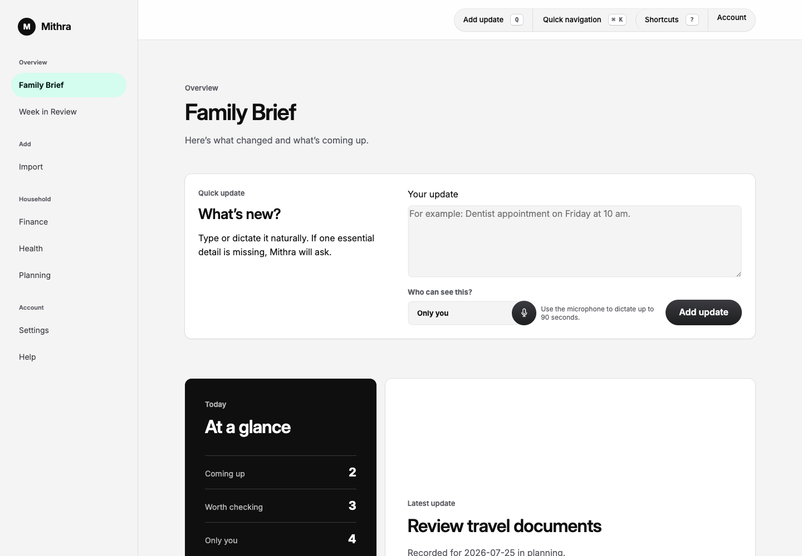
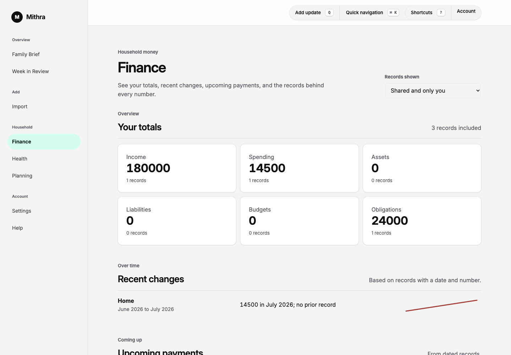
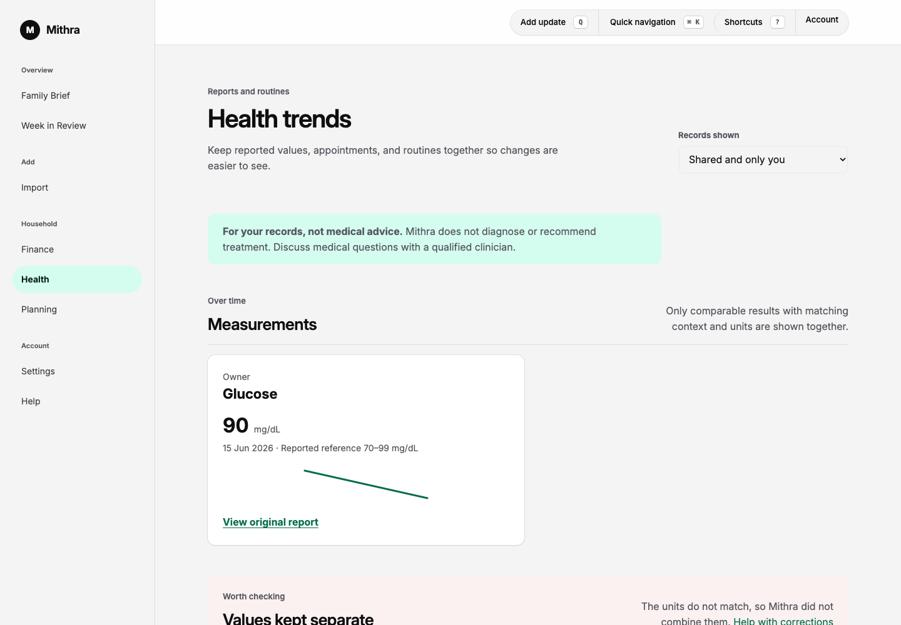
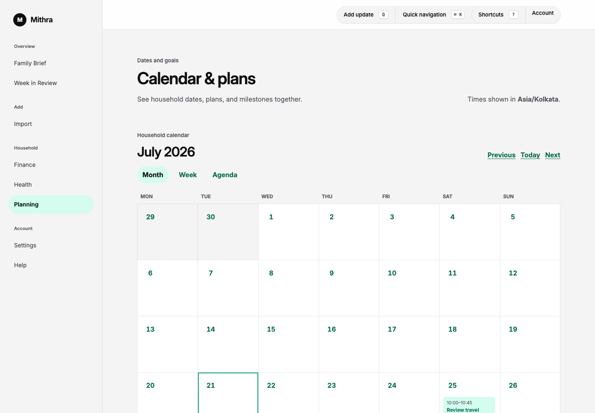
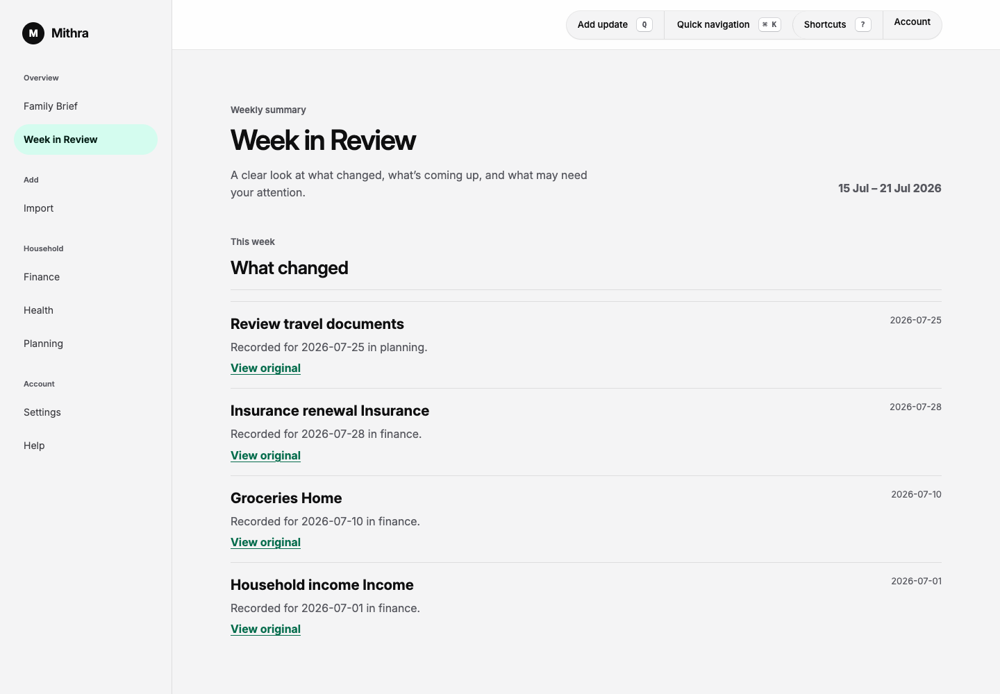

# Product tour

Mithra gives a couple one private place to view household records, correct
imports, and ask for evidence-linked coaching.

## Family Brief

The Family Brief brings the household's latest shared changes, dates, and
signals into one view. The quick capture box accepts text or voice.

## Finance

Finance shows exact totals from saved records. People can correct categories,
dates, and values without changing the source evidence.

## Health

Health keeps reports, measurements, appointments, and routines together. It
shows trends from the records but does not diagnose or give medical advice.

## Planning

Planning gives a month, week, and agenda view of dated household records. Timed
events keep their time and can be exported as a reviewed calendar copy.

## Week in Review

Each adult gets a private Week in Review. It cites the records behind each note
and keeps the other adult's private records out of view.

